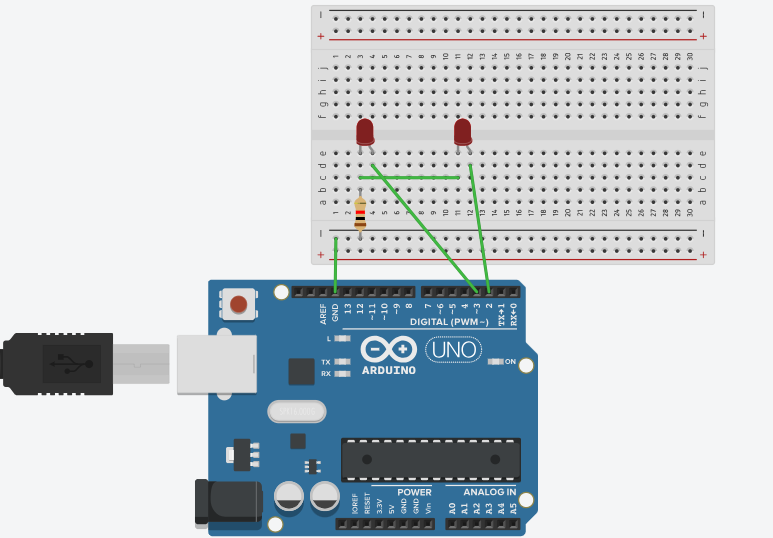
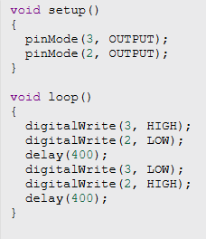

# Reto 1: Encendido alternativo de dos diodos led.

Esta practica se dedica a conseguir que dos diodos led se enciendan alternativamente, uno encendido y otro apagado, y despues de un tiempo asignado estos dos hagan lo opuesto, y asi sucesivamente.

[Pincha aquí para ver la prueba en tinkercad](https://www.tinkercad.com/things/jdIYAWvcs1k-grand-elzing-migelo/editel?returnTo=https%3A%2F%2Fwww.tinkercad.com%2Fdashboard)

Prueba en tinkercad:

Explicación del Código:

Video:

             

Vídeo realizado por (Lorenzo/@LorenRobótica879)

El vídeo lo he sacado de Youtube

