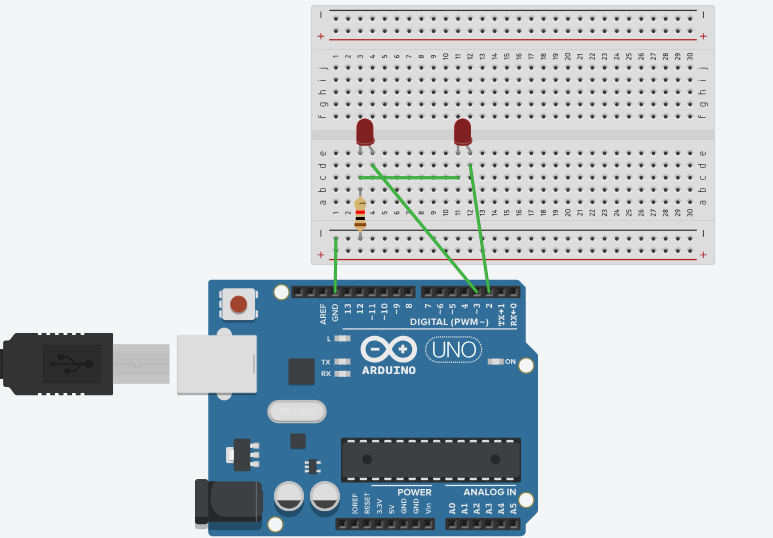
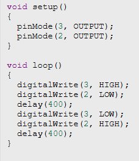
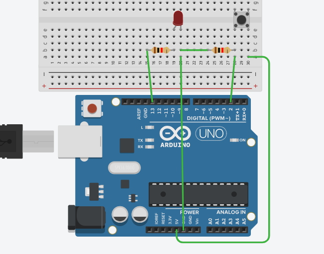

# Reto 1: Encendido alternativo de dos diodos led.

Esta practica se dedica a conseguir que dos diodos led se enciendan alternativamente, uno encendido y otro apagado, y despues de un tiempo asignado estos dos hagan lo opuesto, y asi sucesivamente.

[Pincha aquí para ver la prueba en tinkercad](https://www.tinkercad.com/things/jdIYAWvcs1k-grand-elzing-migelo/editel?returnTo=https%3A%2F%2Fwww.tinkercad.com%2Fdashboard)

Prueba en tinkercad:

El circuito tiene un Arduino conectado a dos LEDs mediante una protoboard. El programa hace que los dos LEDs se enciendan y apaguen alternativamente cada 1 segundo.

El Arduino es el cerebro del circuito y controla los Leds.

La Protoboard sirve para montar y conectar los componentes sin soldar.

Los leds se encienden cuando reciben corriente.

La resistencia limita la corriente para proteger los Leds.

Los cables conecta el Arduino con los diferentes componentes.

El cable USB alimenta el Arduino y permite cargar el programa desde el ordenador.

El circuito consiste de una placa Arduino, una protoboard, dos diodos led, cables y una resistencia.

Explicación del Código:

El void setup es donde se declaran las variables. Los pines 2 y 3 están marcados como output.

El void loop es donde se ejecuta el código se repite de forma infinita.

El pin 3 se enciende (HIGH) mientras que el 2 se apaga (LOW).

El delay hace una espera antes de seguir, en este caso la espera es de 400 milisegundos,

El pin 3 ahora se apaga (LOW), mientras que el 2 ahora es el encendido (HIGH)

Otro delay de 400 milisegundos, y el loop se repite.

# Reto 2

